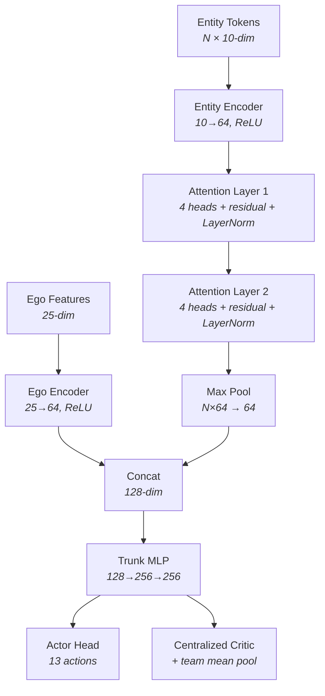

# DroneSwarm

[**Live Demo**](https://andersonvc.github.io/droneswarm/)

Multi-agent reinforcement learning for autonomous drone swarm combat, built on a DoD-aligned control hierarchy.

Two swarms fight to destroy each other's targets. One side learns through RL. The other uses doctrine — rule-based force allocation modeled after real military C2. The RL agent has to figure out attack strategies, target prioritization, and team coordination from scratch.

---

## Control Hierarchy

The autonomy stack follows established military/robotics control architectures (3T, DARPA OFFSET, NATO C2, Boyd's OODA loop). Each layer operates at a different timescale, and lower layers can override higher layers for safety — matching Brooks' subsumption principle.

```
DOCTRINE    Force allocation across the swarm          seconds–minutes
    |
STRATEGY    Tactical decomposition (attack/defend)     sub-second–seconds
    |
TASK        Individual drone mission sequencing        per decision step
    |
BEHAVIOR    Steering, collision avoidance (ORCA/APF)   per tick (reactive)
    |
PLATFORM    Vehicle kinematics and physics             sub-tick
```

| Layer | What it decides | Implementation |
|-------|----------------|----------------|
| **Doctrine** | "50% defend, 50% attack" | `SwarmDoctrine` — adaptive force allocation based on threat proximity and posture |
| **Strategy** | "Squad 1: patrol perimeter. Squad 2: attack target B." | `AttackZoneStrategy`, `DefendAreaStrategy`, `PatrolPerimeterStrategy` |
| **Task** | "Intercept drone #7" or "Attack position (800, 800)" | 7 task types with state machines (approach → engage → retreat) |
| **Behavior** | "Evade — collision imminent" | ORCA, APF, velocity obstacles, separation — via behavior trees |
| **Platform** | Acceleration clamping, turn rate limits, position integration | `GenericPlatform` with configurable flight dynamics |

Information flows both directions: goals go down, status and feedback go up. A drone's task says "fly toward the enemy." Its safety layer says "but avoid the friendly drone in my path." The task adapts.

See [`docs/control-hierarchies.md`](docs/control-hierarchy.md) for the full literature survey mapping our architecture to 3T, DARPA OFFSET, ALFUS, and subsumption.

---

## RL Training

The RL agent replaces the Doctrine + Strategy layers. Instead of rule-based force allocation, a learned policy observes the battlefield and selects per-drone actions directly.

**Architecture**: Entity-attention policy with MAPPO centralized critic and QMIX value decomposition.



Full architecture diagrams in [`docs/architecture.md`](docs/architecture.md).

**Training setup**:
- PPO with per-drone GAE and centralized critic baseline
- QMIX value decomposition for team credit assignment
- Curriculum learning: 4v4 → 8v8 → 16v16 → 24v24 (win-rate gated, with demotion)
- Self-play via checkpoint pool + doctrine opponents
- Action masking to prevent invalid moves

**13 actions**: attack nearest/farthest/least-defended target (direct or evasive), intercept nearest/2nd-nearest drone or cluster, defend tight/wide, patrol, evade.

### Running training

```bash
cd rl-train && pip install -e . && python train.py
```

Recent 4v4 run:
```
Update 10: win_A=12%,  mean_r=-8.01
Update 25: win_A=36%,  mean_r=+2.19
Update 35: win_A=58%,  mean_r=+3.60
```

---

## The Simulation

The game engine handles combat between two groups in a bounded 2D world.

- **Drones** are loitering munitions — they fly to a target and detonate (187.5m blast radius), destroying the target and anything nearby
- **Targets** are static positions. Destroy all enemy targets to win.
- **Doctrine AI** autonomously allocates forces between defense (patrol orbits, intercept threats) and offense (coordinated attack waves)
- Each drone runs the full control hierarchy: task assignment → behavior tree → safety layer → platform physics

The sim runs headless for training (~300 FPS across 1024 parallel environments) and renders in the browser via WASM for visualization.

---

## Browser Visualization

A SvelteKit webapp renders the sim in real-time through WASM. You can watch trained agents play, swap strategies per group, configure drone counts and world size, and draw patrol routes.

```bash
./dev.sh  # Builds WASM + starts dev server at localhost:5173
```

---

## Project Structure

```
droneswarm/
├── drone-lib/        Core simulation library
│   ├── game/         Game engine, physics, rewards, observations
│   ├── doctrine/     Force allocation (the "commander")
│   ├── strategies/   Patrol, attack, defend (the "officers")
│   ├── tasks/        Per-drone mission execution (the "soldiers")
│   ├── behaviors/    Collision avoidance, steering (reactive layer)
│   └── platform/     Vehicle kinematics
│
├── rl-train/         RL training pipeline (Rust sim bindings + PyTorch)
│   ├── src/lib.rs    PyO3 vectorized environment wrapper
│   └── train.py      PPO training loop, policy network, curriculum
│
├── wasm-lib/         Rust → WASM bridge
└── webapp/           SvelteKit frontend
```

## Building

**Prerequisites**: Rust (stable), Node.js 18+, wasm-pack

```bash
./dev.sh                                          # Dev server
cd rl-train && pip install -e . && python train.py  # Training
cargo test --workspace --exclude wasm-lib          # Run tests
```

## Disclaimer

This project is a research and educational tool. It does not contain controlled technology — the simulator is a simple 2D physics engine, and all autonomy and RL techniques are derived from publicly available academic literature. Drone combat serves as the problem domain because it makes multi-agent coordination tangible and easy to evaluate, but the underlying architecture is domain-agnostic. The same approach generalizes to any cooperative multi-agent setting: logistics fleets, search and rescue, environmental monitoring, warehouse robotics, etc.

## License

MIT
