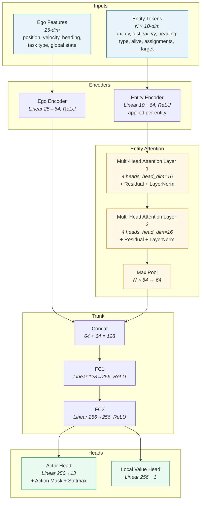
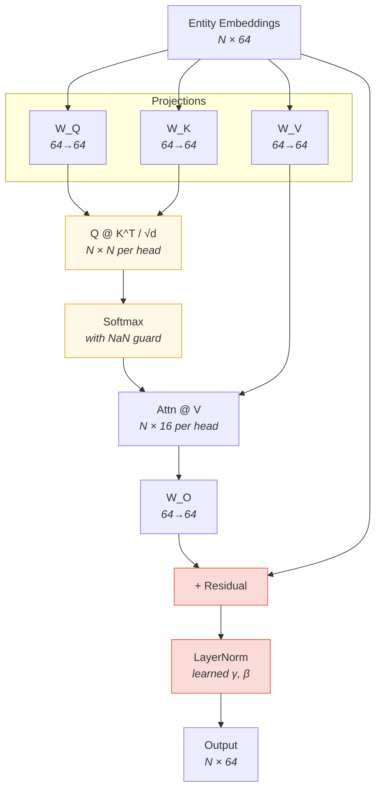
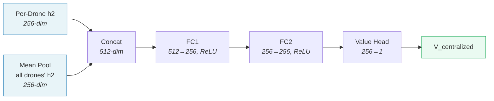
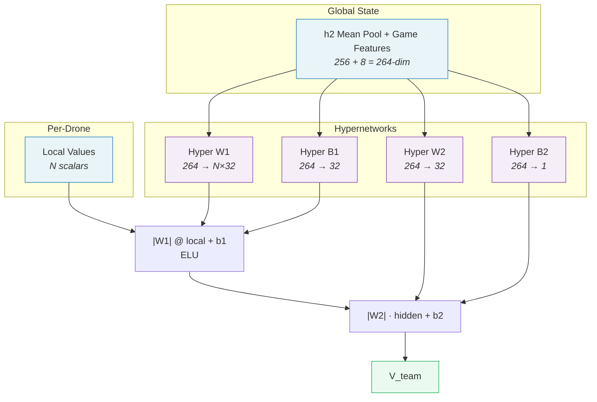
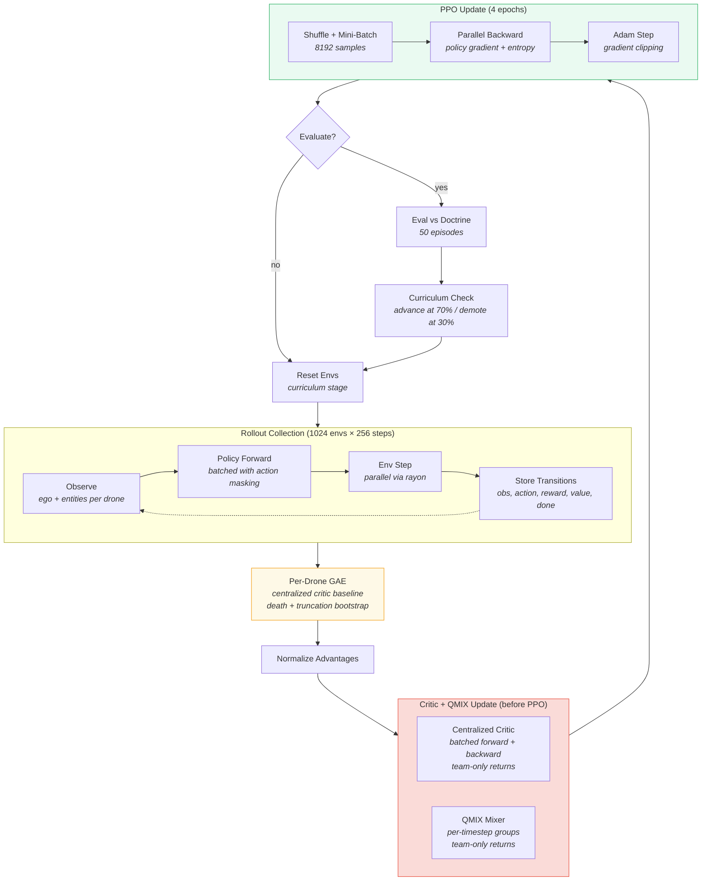

# RL Network Architecture

## Policy Network (PolicyNetV2)

Per-drone actor-critic with entity-attention. Each drone observes its own ego state and a variable number of entity tokens (other drones, targets), processes them through shared encoders and attention, then selects an action.

## Attention Block Detail

Each attention layer contains self-attention over entity embeddings with a residual connection and post-residual layer normalization.

## MAPPO Centralized Critic

Sees each drone's trunk representation plus the mean of all drones' representations in the environment. Produces a centralized value estimate used for GAE advantage computation.

## QMIX Value Decomposition

Combines per-drone local values into a team value using hypernetwork-generated monotonic mixing weights, conditioned on global state.

## Training Loop

