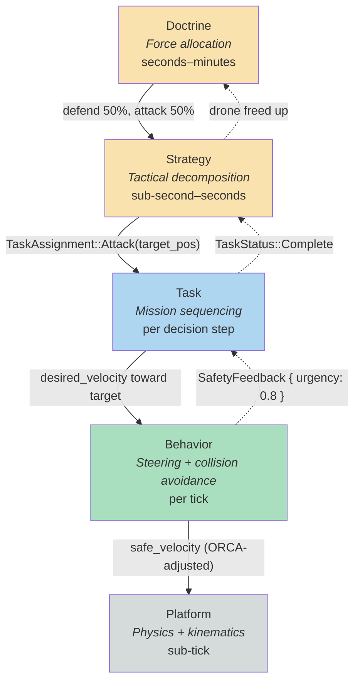
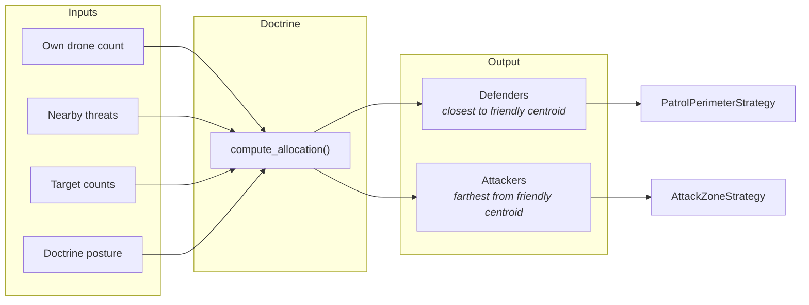
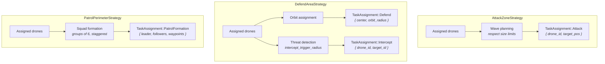
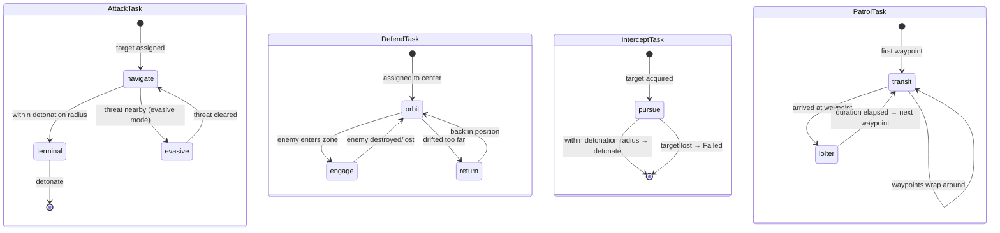
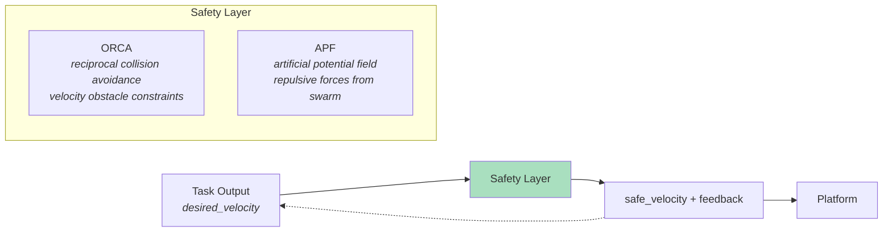
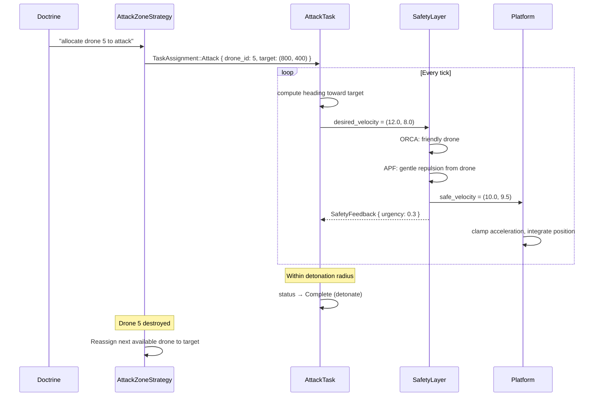

# How the Control Hierarchy Works

This describes the actual implementation — what each layer does, how they talk to each other, and where the interesting design decisions are.

The original literature survey is in [control-hierarchies.md](control-hierarchies.md). This document is about what I built.

## The Stack

Five layers, each running at a different speed. Goals flow down. Feedback flows up. Lower layers can override higher layers when safety demands it.



The key insight from the 3T literature: the task layer in the middle is what makes the whole thing robust. Without it, you get either slow deliberation that can't react, or fast reflexes with no plan.

---

## Doctrine

`drone-lib/src/doctrine/mod.rs`

This is the commander. It looks at the overall situation — how many drones we have, how many targets, where threats are — and decides how to split forces between defense and offense.

```rust
pub enum DoctrineMode {
    Defensive,   // 50% min defenders, capped attack waves (2 per target)
    Aggressive,  // 15% min defenders, unlimited attack waves
}
```

The allocation logic is straightforward. Count nearby threats. If threats are close to friendly targets, bias toward defense. Otherwise follow the posture setting. The output is a partition: these drones defend, those drones attack.



Doctrine reassesses every 60 ticks, or immediately when a target gets destroyed. The partition is spatial — defenders are the drones closest to the friendly target centroid, attackers are the ones farthest away. This naturally assigns drones that are already near friendly targets to defense, and drones that are already forward-deployed to attack.

One design decision I went back and forth on: should doctrine also manage the RL agent's drones? Currently the RL policy replaces doctrine entirely — it picks per-drone actions directly. Doctrine only runs for the rule-based opponent (Group B). The RL agent has to learn force allocation from scratch, which is harder but more general.

---

## Strategy

`drone-lib/src/strategies/`

Strategies take a group of drones and produce task assignments. Each strategy owns a set of drone IDs and ticks independently.

```rust
pub trait SwarmStrategy {
    fn tick(&mut self, own_drones: &[StrategyDroneState], ...) -> Vec<TaskAssignment>;
    fn is_complete(&self) -> bool;
    fn update_targets(&mut self, friendly: &[Position], enemy: &[Position]);
}
```

Three strategies implemented:

**AttackZoneStrategy** — Sends drones at enemy targets in waves. Respects wave size limits from doctrine (defensive mode caps at 2 per target, aggressive is unlimited). When a target gets destroyed, surviving attackers are reassigned to the next target. Maintains detonation radius spacing between friendly attackers so they don't chain-detonate each other.

**DefendAreaStrategy** — Keeps drones in orbit around a center position. When an enemy drone enters the intercept trigger radius, dispatches the nearest idle defender as an interceptor. Tracks which threats are already being intercepted so it doesn't double-assign. When an intercept completes (target killed or lost), the drone returns to orbit.

**PatrolPerimeterStrategy** — Divides drones into squads of up to 6. Each squad patrols the perimeter around friendly targets in formation. Squads are staggered for coverage. Like DefendAreaStrategy, it dispatches interceptors when enemies approach, pulling from the nearest patrol squad.



The `TaskAssignment` enum is the interface between strategy and task:

```rust
pub enum TaskAssignment {
    Attack { drone_id, target: Position },
    Defend { drone_id, center, orbit_radius, engage_radius },
    Intercept { drone_id, target_id },
    InterceptGroup { drone_id },
    Patrol { drone_id, waypoints, loiter_duration },
    Loiter { drone_id, position },
    PatrolFormation { leader_id, follower_ids, waypoints, loiter_duration },
}
```

---

## Task

`drone-lib/src/tasks/`

This is where individual drone behavior gets sequenced. Each task is a state machine with phases. The task observes the world, decides what to do, and produces a desired velocity. It doesn't worry about collision avoidance — that's the behavior layer's job.

```rust
pub trait DroneTask {
    fn tick(&mut self, state: &State, swarm: &[DroneInfo], ...) -> TaskOutput;
    fn process_feedback(&mut self, feedback: &SafetyFeedback);
    fn status(&self) -> TaskStatus;  // Active, Complete, Failed
    fn phase_name(&self) -> &str;
}
```

Seven task types:



The interesting part is the feedback loop with the safety layer. When a task produces a desired velocity, the safety layer might deflect it to avoid a collision. The safety layer sends back a `SafetyFeedback` struct:

```rust
pub struct SafetyFeedback {
    pub urgency: f32,              // 0.0 = safe, 1.0 = critical
    pub threat_direction: Option<Vec2>,
    pub safe_velocity: Vec2,
}
```

Tasks can use this to transition phases. An `AttackTask` in navigate phase might switch to evasive if urgency gets high enough. A `DefendTask` might engage a threat it wasn't originally tracking because the safety layer flagged something close.

This is the subsumption principle in practice — the task says "go forward," the safety layer says "but there's something in your way," and the task adapts.

---

## Behavior

`drone-lib/src/behaviors/`

The reactive layer. No planning, no memory — just sensor-actuator loops that keep the drone alive.

The safety layer wraps every task's output:



The design went through a couple iterations. Originally ORCA and APF were nodes in a behavior tree, sequenced with the waypoint-seeking behavior. That didn't work — SeekWaypoint and ORCA fought each other every tick because they had conflicting velocity objectives. The fix was pulling collision avoidance out of the behavior tree entirely and making it a separate safety layer that wraps any task's output. Much cleaner separation of concerns.

**ORCA** (Optimal Reciprocal Collision Avoidance) — Constructs half-plane velocity constraints for each nearby drone, then finds the velocity closest to the desired velocity that satisfies all constraints. The key property: each drone takes half the avoidance responsibility, so they cooperatively resolve conflicts without communication.

**APF** (Artificial Potential Field) — Simpler repulsive forces for mid-range separation. Inverse-square falloff from nearby swarm members. Clamped to a max force magnitude to prevent instability.

**Separation** — Pairwise repulsion for close-range spacing. Simpler and cheaper than ORCA but less sophisticated about velocity prediction.

There's also a behavior tree infrastructure (`behaviors/tree/`) with composite nodes (Sequence, Selector, Parallel) and action nodes (SeekWaypoint, ORCAAvoid, APFAvoid). It's still there but mostly used for the initial waypoint navigation. The safety layer handles the collision avoidance for task-driven flight.

---

## Platform

`drone-lib/src/platform/`

The physics. Takes a desired velocity (after safety processing) and applies it within the drone's kinematic constraints.

```rust
pub trait Platform {
    fn apply_velocity_steering(&mut self, desired: Velocity, heading: Option<Heading>, dt: f32);
    fn state(&self) -> &State;
    fn perf(&self) -> &DronePerfFeatures;
}
```

`GenericPlatform` models a quadcopter-style vehicle:
- Max velocity: 20 m/s (configurable)
- Max acceleration: 7 m/s^2
- Turn rate that scales with speed (slower at higher speeds, tighter turns when slow)
- Position integration: `pos += vel * dt`, `vel += clamp(acc, max_acc) * dt`

Nothing fancy here. The constraints exist to keep the simulation physically plausible — drones can't teleport or turn on a dime. The task and behavior layers have to work within these limits, which creates more realistic maneuvering.

---

## How It All Fits Together

A concrete example: drone #5 gets assigned to attack an enemy target.



The whole thing runs at 50Hz (dt=0.05s). At training speed (2x multiplier), that's 100 sim-seconds per real-second. The doctrine layer reassesses every 60 ticks (~3 seconds sim time). Tasks run every tick. The safety layer runs every tick. Platform physics run every tick.

In training, the RL agent replaces the doctrine and strategy layers — it picks per-drone actions every 20 ticks (1 second sim time). The task, behavior, and platform layers are the same whether running RL or doctrine. This means the RL agent is learning to be a better commander, not a better pilot. The piloting (collision avoidance, kinematics) is handled by the lower layers regardless.

---

## Cross-Reference

How this project's layers map to established frameworks.

| This Project | DoD C2 Doctrine | DARPA OFFSET | 3T Architecture | Brooks Subsumption |
|---|---|---|---|---|
| **Doctrine** | Strategic — campaign-level force allocation, resource prioritization | Mission — top-level swarm objective | Deliberator — goal reasoning, resource allocation | *(not covered — no deliberation)* |
| **Strategy** | Operational — how forces maneuver to achieve strategic goals | Tactics — compositions of primitives, sequenced or concurrent | Deliberator/Sequencer boundary — plan selection | *(not covered)* |
| **Task** | Tactical — individual unit mission execution | Primitives — reusable swarm behaviors (secure perimeter, identify ingress) | Sequencer — activates/deactivates reactive skills, monitors execution | *(not covered — no sequencing)* |
| **Behavior** | Engagement — immediate maneuver decisions (fire, evade) | Algorithms — low-level implementations (flocking, consensus) | Reactive/Skills — direct sensor-actuator loops | Layer 0-1 — obstacle avoidance, wandering |
| **Platform** | *(implicit — vehicle limitations are physical constraints)* | *(implicit)* | *(implicit — actuator control)* | Layer 0 — hardware interface |

A few things worth noting:

The DoD model has an **operational** layer between strategic and tactical that I don't have a clean equivalent for. Doctrine jumps straight to individual task assignment. For 4v4 this works fine — there's no need for sub-swarm coordination when you only have 4 drones. At 24v24 this becomes a gap. A squad-level coordination layer would sit between Strategy and Task.

DARPA OFFSET maps most cleanly to what I built. Their Mission/Tactics/Primitives/Algorithms decomposition is almost 1:1 with Doctrine/Strategy/Task/Behavior. OFFSET was designed specifically for drone swarms, so this isn't a coincidence — I used it as the primary reference.

The 3T architecture's key contribution is the **sequencer** — the middle layer that isn't planning and isn't reacting, but orchestrating which reactive skills are active. That's exactly what the Task layer does. A DefendTask doesn't plan a defense — it monitors the situation and switches between orbit, engage, and return phases. The task layer is the glue.

Brooks' subsumption only covers the bottom of the stack. But the principle it introduced — **lower layers override higher layers for safety** — runs through the whole design. The safety layer can deflect any task's desired velocity when a collision is imminent. The task doesn't get a vote.
