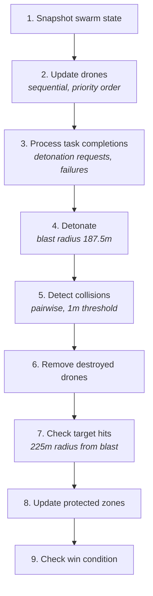
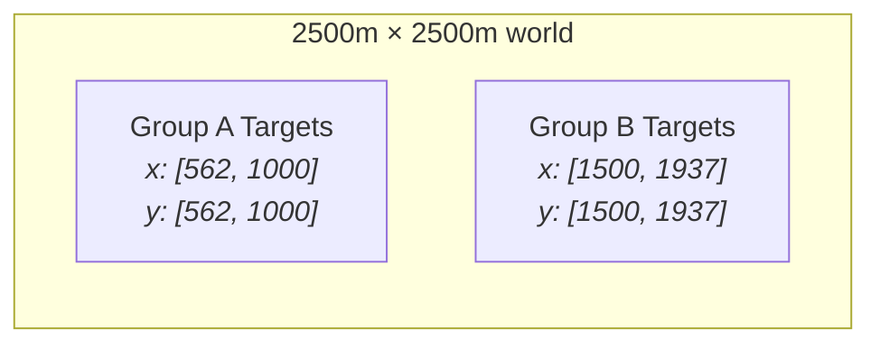
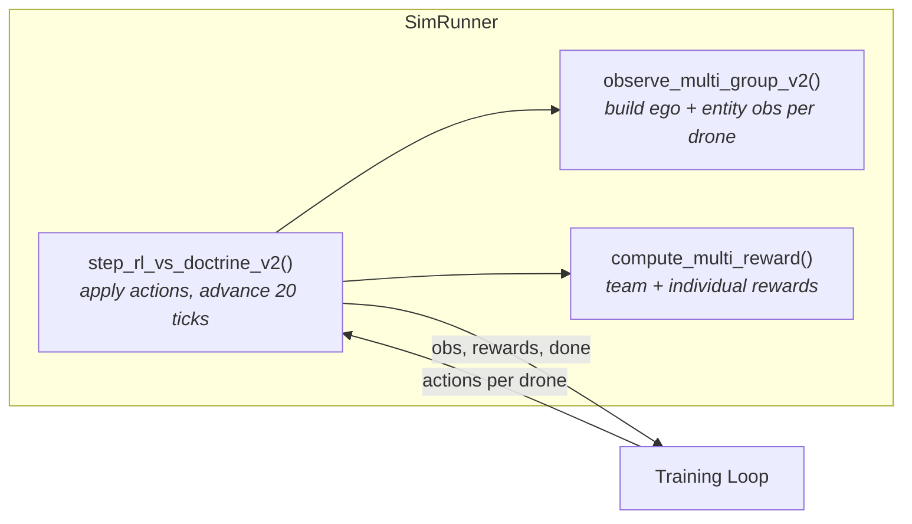

# The Simulator

How the game engine works, how it talks to the RL training pipeline, and how it runs in the browser through WASM.

## Game Loop

The engine runs at 50Hz (dt=0.05s). Each tick executes in this order:



The ordering matters. Drones update in priority order so later drones see earlier drones' new positions — this prevents symmetric deadlocks in collision avoidance. Detonations happen before collision detection so blast kills are processed before pairwise overlap checks. Target hits are checked against blast positions, not drone positions, because the detonating drone is already gone by that point.

A tick produces a `TickResult`:
```rust
pub struct TickResult {
    pub destroyed_ids: HashSet<usize>,
    pub blast_positions: Vec<Position>,
    pub targets_changed: bool,
    pub game_result: GameResult,  // AWins, BWins, Draw, InProgress
}
```

## World Layout

Square world, default 2500m per side. Toroidal boundaries — fly off one edge, appear on the opposite side.



Targets spawn in opposite quadrants with random jitter within 150m clusters. Drones spawn near their own targets. The gap between the two groups is roughly 700-1000m depending on jitter — about 350-500 ticks of travel at max speed (20 m/s).

Distance calculations use the shortest toroidal path. A drone at x=50 and a target at x=2450 are 100m apart, not 2400m.

## Detonation Mechanics

Drones are weapons. When a drone's task says "detonate" (usually because it reached a target), the engine queues it. Next tick:

1. The drone explodes at its current position
2. Everything within 187.5m of the blast is destroyed — enemy drones, friendly drones, doesn't matter
3. If the blast is within 225m of an enemy target, the target is destroyed

The 225m target hit radius is wider than the 187.5m drone blast radius. This is intentional — the drone has to get close but doesn't need a direct hit.

There's a protected zone system that prevents drones from detonating near their own targets. Without this, a drone intercepting an enemy near a friendly target would kill the target it's supposed to defend.

## Win Conditions

The game ends when one side has no "effective targets" left. Effective targets account for the endgame: if a side loses all its drones, each remaining enemy drone is treated as destroying one target (since nothing can stop them).

```rust
if drones_a_alive == 0 {
    effective_a = targets_a - drones_b_alive  // enemies will clean up
}
```

So if Group A has 2 targets and 0 drones, and Group B has 3 drones left, Group A's effective targets = max(0, 2-3) = 0. Group B wins.

Draw if both sides hit zero effective targets, or if the tick limit is reached.

## SimRunner: The RL Interface

The game engine doesn't know anything about RL. `SimRunner` wraps it to provide the observe/step/reward interface that the training loop needs.



Each RL decision step advances 20 engine ticks (1 second sim time at 2x speed multiplier). During those 20 ticks:

- The engine ticks normally
- Doctrine runs for Group B (if not self-play)
- Idle Group A drones get their last action re-applied
- Detonation events are tracked for individual rewards
- Target alive states are snapshotted before each tick for correct reward attribution

### Three Step Modes

**`step_rl_vs_doctrine_v2`** — Group A is RL, Group B runs doctrine. This is the main training mode.

**`step_multi_selfplay`** — Both groups are RL. Used when self-play is enabled (later curriculum stages).

**`step_multi`** — Older V1 interface with flat 64-dim observations. Still used by some WASM code paths.

### Reset

On reset, the world is rebuilt from a seed:
1. Generate target positions (random within quadrant clusters)
2. Spawn drones near their targets
3. Build patrol routes around targets
4. Initialize doctrine for Group B
5. Snapshot initial counts for reward normalization

The seed makes everything deterministic — same seed, same world layout, same drone positions.

## Observations

Two formats. V1 is a flat 64-dim vector (legacy). V2 is what the current RL architecture uses.

### V2 Observations

Each drone gets its own observation: 25-dim ego features plus a variable number of 10-dim entity tokens.

**Ego (25 floats)**:
- Position (x/w, y/w), velocity (vx/max_v, vy/max_v), heading
- Last action taken (normalized)
- Task type one-hot (9 slots — attack, defend, intercept, etc.)
- Task phase (0=early, 0.33=active, 0.67=terminal, 1.0=complete)
- Relative alive index (this drone's rank among surviving teammates)
- Global state: own/enemy drone counts, own/enemy target counts, time fraction, nearby threats, nearest friendly distance, friendlies in blast radius

**Entity tokens (10 floats each, up to 64 entities)**:
- Relative position (dx/w, dy/w), distance (dist/diagonal)
- Velocity (vx/max_v, vy/max_v)
- Relative heading
- Type flag (0.0=enemy drone, 0.33=friendly drone, 0.67=enemy target, 1.0=friendly target)
- Alive flag (1.0 real, 0.0 padding)
- Assignment count (how many friendlies are targeting this entity)
- Is current target (1.0 if this is my task's target)

Entities are sorted by distance within each type group — enemy drones first (nearest to farthest), then friendly drones, enemy targets, friendly targets.

All continuous features are pre-normalized to roughly [-1, 1] range in the observation encoder. The RL training pipeline doesn't apply additional entity normalization — just ego normalization via running mean/std.

## Reward Signal

Rewards come from two sources:

**Team reward** (shared, from `reward.rs`):
- Win: +10, Loss: -10, Draw: -8
- Enemy target destroyed: +3 per target
- Friendly target lost: -3 per target
- Enemy drone killed: +0.3
- Time pressure: quadratic penalty that ramps up late game

**Individual reward** (per-drone, computed from detonation events):
- Blast hits enemy target: +2.0
- Blast hits enemy drone: +0.5
- Critical intercept (enemy was near friendly target): +1.0 bonus
- Proximity to threats: small continuous bonus for defensive positioning

Each drone receives the full team reward plus its own individual reward. The centralized critic handles credit assignment — the per-drone signal is just for direct behavioral shaping.

## WASM Integration

The same simulation runs in the browser. The wasm-lib crate wraps the core types with `#[wasm_bindgen]` annotations and handles coordinate conversion.

```mermaid
graph TD
    subgraph "Browser"
        JS["SvelteKit App<br/><i>TypeScript</i>"]
        CANVAS["Canvas Renderer"]
    end

    subgraph "WASM Boundary"
        BRIDGE["SwarmManager<br/><i>TypeScript wrapper</i>"]
        HANDLE["SwarmHandle<br/><i>wasm_bindgen</i>"]
    end

    subgraph "Rust (compiled to WASM)"
        SWARM["Swarm struct<br/><i>drones, targets, doctrines</i>"]
        SCALE["WorldScale<br/><i>pixel ↔ meter conversion</i>"]
        INFERENCE["InferenceNetV2<br/><i>optional RL model</i>"]
    end

    JS -->|"tick(dt)"| BRIDGE
    BRIDGE -->|"FFI call"| HANDLE
    HANDLE --> SWARM
    SWARM --> SCALE
    SWARM --> INFERENCE

    SWARM -->|"get_render_state()"| HANDLE
    HANDLE -->|"DroneRenderData[]"| BRIDGE
    BRIDGE --> CANVAS
```



### Coordinate Pipeline

The webapp works in pixels. The simulation works in meters. Conversion happens at the WASM boundary.

```
TypeScript click (400px, 300px)
    → WorldScale.to_meters() → (1000m, 750m)
    → Engine processes in meters
    → WorldScale.to_pixels() → (400px, 300px)
    → Canvas renders
```

Default mapping: 1000x1000px canvas = 2500x2500m world = 0.4 px/m.

### RL in the Browser

The webapp can load a trained model (exported as JSON from the training pipeline) and run it live:

1. TypeScript fetches `best_model.json` + `best_model_normalizers.json`
2. Passes JSON string to WASM via `load_rl_model_multi()`
3. WASM deserializes into `InferenceNetV2` (same architecture as training `PolicyNetV2`, minus gradients)
4. Every 20 ticks, WASM builds V2 observations for each drone, runs the model forward pass, and applies the selected action

The inference network is structurally identical to the training network — ego encoder, entity encoder, 2-layer attention, max pool, trunk MLP, actor head. It just doesn't carry gradient caches or optimizer state. Serialization format is the same (serde JSON), so a checkpoint from training drops straight into the browser.

### The Swarm Struct

The WASM `Swarm` is similar to the headless `GameEngine` but carries extra state for rendering and RL:

- Drone colors and selection state (for the UI)
- Explosion animations (800ms duration with blast radius visualization)
- RL agent state (loaded models, tick counters, last actions)
- Formation tracking (leader/follower relationships for patrol squads)
- Strategy state (which group is using which strategy)

The webapp's game loop runs on `requestAnimationFrame`. Each frame calls `tick(dt)` where dt comes from the browser's frame timing, clamped to 0.05s max to prevent physics explosion when the tab is backgrounded.

### What Gets Deployed

```
webapp/build/
├── index.html
├── _app/                    # SvelteKit compiled assets
└── wasm-lib/pkg/
    ├── wasm_lib_bg.wasm     # ~423KB uncompressed, ~100KB gzipped
    └── wasm_lib.js          # Generated JS bindings
```

Static site. No server needed. The WASM binary contains the entire simulation, doctrine AI, and inference network. Model weights are loaded separately as a JSON fetch.
