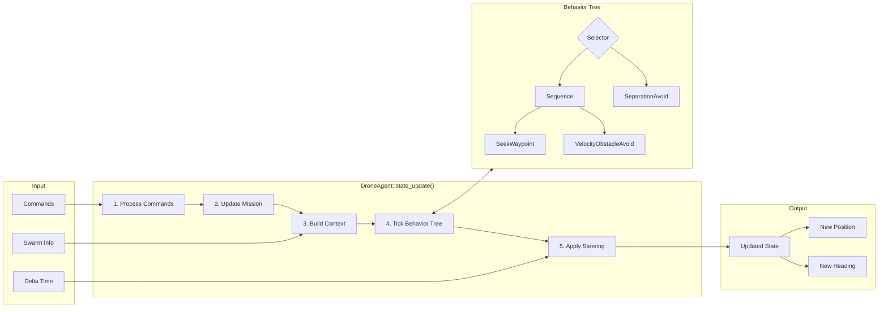
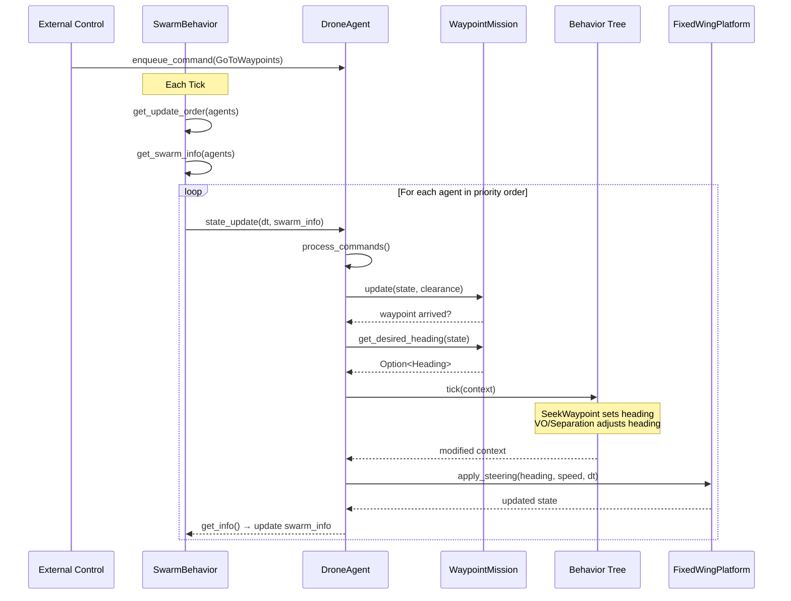

# drone-lib

A modular Rust library for simulating autonomous fixed-wing drone swarms. Built following **MOSA (Modular Open Systems Approach)** principles for composable, extensible autonomy systems.

## Features

- **Modular autonomy stack**: Separate Platform, Mission, and Behavior modules
- **Behavior trees**: Composable decision-making with Sequence, Selector, and Parallel nodes
- **Collision avoidance**: Velocity Obstacle (VO) and separation steering behaviors
- **Path smoothing**: Hermite spline interpolation with Stanley controller
- **Swarm coordination**: Pluggable swarm behaviors for collective decision-making
- **Type-safe physics**: Newtypes for `Position`, `Velocity`, `Heading` prevent unit confusion
- **Toroidal world**: Positions wrap around world boundaries seamlessly
- **WASM-compatible**: No `std::time` or threading dependencies

## Architecture

The library follows MOSA principles, decomposing drone autonomy into independent, composable modules:

```
drone-lib/src/
├── agent/
│   └── drone_agent.rs      # DroneAgent: composed autonomous agent
├── platform/
│   ├── traits.rs           # Platform trait (kinematics interface)
│   └── fixed_wing.rs       # FixedWingPlatform implementation
├── missions/
│   ├── traits.rs           # Mission trait (task interface)
│   ├── task.rs             # Task enum + WaypointMission
│   ├── planner.rs          # PathPlanner (Hermite spline + Stanley)
│   └── command.rs          # AgentCommand + CommandQueue
├── behaviors/
│   ├── tree/
│   │   ├── node.rs         # BehaviorNode trait, BehaviorContext
│   │   └── composite.rs    # Sequence, Selector, Parallel
│   ├── actions/
│   │   ├── seek.rs         # SeekWaypoint action
│   │   └── avoid.rs        # VelocityObstacleAvoid, SeparationAvoid
│   ├── conditions/
│   │   └── collision.rs    # CollisionImminent, HasTarget
│   ├── factory.rs          # Behavior tree factories
│   ├── velocity_obstacle.rs # VO collision avoidance
│   └── separation.rs       # Separation steering
├── swarm/
│   ├── traits.rs           # SwarmBehavior trait
│   └── formation.rs        # FormationBehavior (placeholder)
├── types/                  # Physics primitives and state types
└── models/                 # Legacy Drone trait (deprecated)
```

## Core Concepts

### System Overview

```mermaid
flowchart TB
    subgraph External["External Control"]
        UI[UI / Controller]
    end

    subgraph Swarm["Swarm Coordinator"]
        SB[SwarmBehavior]
        SI[(Swarm Info<br/>DroneInfo[])]
    end

    subgraph Agent1["DroneAgent"]
        subgraph Components["Composition"]
            CQ[CommandQueue]
            M[Mission<br/>WaypointMission]
            BT[Behavior Tree]
            P[Platform<br/>FixedWingPlatform]
        end
    end

    subgraph AgentN["DroneAgent N..."]
        CN[Components...]
    end

    UI -->|"AgentCommand"| CQ
    SB -->|"get_update_order()"| Agent1
    SB -->|"get_swarm_info()"| SI
    SI -->|"DroneInfo[]"| Agent1
    SI -->|"DroneInfo[]"| AgentN
    Agent1 -->|"get_info()"| SI
    AgentN -->|"get_info()"| SI
```

### Per-Tick Update Flow



### Data Flow Detail



### DroneAgent

The `DroneAgent` is the primary API for autonomous drones. It composes:

- **Platform**: Physical kinematics (velocity, turn rate, acceleration)
- **Mission**: Task management (waypoints, routes, objectives)
- **Behavior Tree**: Decision-making (seek, avoid, conditions)

```rust
use drone_lib::{DroneAgent, Position, Heading, Bounds};

let bounds = Bounds::new(1000.0, 1000.0).unwrap();
let agent = DroneAgent::new(
    0,                           // unique ID
    Position::new(100.0, 100.0), // starting position
    Heading::new(0.0),           // facing right (+x)
    bounds,
);
```

### The Autonomy Loop

Each tick, `DroneAgent::state_update()` executes:

```
1. Process commands      ─── CommandQueue provides decoupled control
2. Update mission        ─── Check waypoint arrivals, advance task state
3. Build behavior context ─── Snapshot of state + swarm info + desired heading
4. Tick behavior tree    ─── Seek waypoint, apply collision avoidance
5. Apply to platform     ─── Execute steering with kinematic constraints
```

```rust
// Collect swarm info for inter-drone awareness
let swarm_info: Vec<DroneInfo> = agents.iter()
    .map(|a| a.get_info())
    .collect();

// Update each agent
for agent in &mut agents {
    agent.state_update(dt, &swarm_info);
}
```

## Modules

### Platform

The `Platform` trait defines physical drone kinematics:

```rust
pub trait Platform: Send + Sync + Debug {
    fn apply_steering(&mut self, desired_heading: Heading, desired_speed: f32, dt: f32);
    fn state(&self) -> &State;
    fn perf(&self) -> &DronePerfFeatures;
    fn effective_turn_rate(&self) -> f32;
    // ...
}
```

`FixedWingPlatform` implements realistic fixed-wing constraints:

- **Turn rate scales with speed**: `effective_rate = max_rate * (speed/max_speed)² + min_rate`
- **Continuous forward motion**: Cannot turn without velocity
- **Clamped acceleration**: Respects physical limits

| Parameter | Default | Description |
|-----------|---------|-------------|
| `max_vel` | 120.0 | Maximum velocity (units/s) |
| `max_acc` | 21.0 | Maximum acceleration (units/s²) |
| `max_turn_rate` | 4.0 | Turn rate at max speed (rad/s) |
| `min_turn_rate` | 0.35 | Minimum turn rate at zero speed |

### Missions

The `Mission` trait defines task management:

```rust
pub trait Mission: Send + Sync + Debug {
    fn get_desired_heading(&self, current_state: &State) -> Option<Heading>;
    fn update(&mut self, current_state: &State, clearance: f32);
    fn status(&self) -> MissionStatus;
    fn current_target(&self) -> Option<Position>;
    // ...
}
```

`WaypointMission` supports two task types:

| Task | Behavior |
|------|----------|
| `ReachWaypoint` | Navigate to waypoints in order, complete when done |
| `FollowRoute` | Loop through route waypoints indefinitely |

#### Path Smoothing

`FollowRoute` uses Hermite spline interpolation with a Stanley controller for smooth path following:

```rust
// Get interpolated path for visualization
let spline_points = agent.get_spline_path(20);
```

#### Command Queue

Decouple control from the simulation loop:

```rust
use drone_lib::{AgentCommand, Position};

agent.enqueue_command(AgentCommand::GoToWaypoints {
    waypoints: vec![Position::new(500.0, 500.0)],
});

agent.enqueue_command(AgentCommand::FollowRoute {
    waypoints: vec![
        Position::new(100.0, 100.0),
        Position::new(900.0, 900.0),
    ],
});
```

### Behavior Trees

Behavior trees provide composable decision-making:

```rust
use drone_lib::behaviors::{
    BehaviorNode, BehaviorStatus, BehaviorContext,
    Sequence, Selector, SeekWaypoint, VelocityObstacleAvoid,
};
```

#### Node Types

| Type | Description |
|------|-------------|
| `Sequence` | Runs children in order; fails if any child fails |
| `Selector` | Runs children until one succeeds |
| `Parallel` | Runs all children; succeeds when threshold met |

#### Built-in Actions

| Action | Description |
|--------|-------------|
| `SeekWaypoint` | Sets desired heading toward current waypoint |
| `VelocityObstacleAvoid` | Adjusts heading to avoid predicted collisions |
| `SeparationAvoid` | Steers away from nearby drones |

#### Built-in Conditions

| Condition | Description |
|-----------|-------------|
| `CollisionImminent` | True if drone within threshold distance |
| `HasTarget` | True if mission has a current waypoint |

#### Default Behavior Tree

The factory creates this structure:

```
Selector (root)
├── Sequence (navigate_with_avoidance)
│   ├── SeekWaypoint           # Set heading from mission
│   └── VelocityObstacleAvoid  # Adjust for collision avoidance
└── SeparationAvoid            # Fallback reactive avoidance
```

```rust
use drone_lib::behaviors::create_fixed_wing_bt;

let bt = create_fixed_wing_bt(vo_config, sep_config);
```

### Swarm

The `SwarmBehavior` trait coordinates multiple agents:

```rust
pub trait SwarmBehavior: Send + Sync + Debug {
    fn pre_tick(&mut self, agents: &[DroneAgent], dt: f32);
    fn get_update_order(&self, agents: &[DroneAgent]) -> Vec<usize>;
    fn post_tick(&mut self, agents: &[DroneAgent], dt: f32);
    fn get_swarm_info(&self, agents: &[DroneAgent]) -> Vec<DroneInfo>;
}
```

| Behavior | Priority Rule |
|----------|---------------|
| `DefaultSwarmBehavior` | Lower ID = higher priority |
| `WaypointPriorityBehavior` | Closer to waypoint = higher priority |
| `FormationBehavior` | Leader first, then by ID |

## Collision Avoidance

Two complementary approaches:

### Velocity Obstacles (VO)

Predictive avoidance that projects future positions:

```rust
use drone_lib::VelocityObstacleConfig;

let config = VelocityObstacleConfig {
    lookahead_time: 1.5,      // seconds to look ahead
    time_samples: 10,         // samples along trajectory
    safe_distance: 60.0,      // minimum separation
    detection_range: 150.0,   // scan radius
    avoidance_weight: 0.7,    // blending factor
};
```

### Separation

Reactive steering away from nearby drones:

```rust
use drone_lib::SeparationConfig;

let config = SeparationConfig {
    radius: 100.0,      // detection radius
    max_force: 50.0,    // maximum steering force
};
```

## Toroidal World

The simulation uses wraparound geometry:

```rust
let bounds = Bounds::new(1000.0, 1000.0).unwrap();

// Shortest distance (wraps around edges)
let dist = bounds.distance(
    Vec2::new(950.0, 500.0),
    Vec2::new(50.0, 500.0),
);
// dist = 100.0 (not 900.0)

// Direction vector for navigation
let delta = bounds.toroidal_delta(
    Vec2::new(950.0, 500.0),
    Vec2::new(50.0, 500.0),
);
// delta = Vec2(100.0, 0.0) (points through the wrap)
```

## Complete Example

```rust
use drone_lib::{
    DroneAgent, DroneInfo, Position, Heading, Bounds,
    Objective, ObjectiveType,
};
use std::collections::VecDeque;
use std::sync::Arc;

fn main() {
    let bounds = Bounds::new(1000.0, 1000.0).unwrap();

    // Create swarm
    let mut agents: Vec<DroneAgent> = (0..10)
        .map(|i| {
            let x = 100.0 + (i as f32) * 80.0;
            DroneAgent::new(i, Position::new(x, 500.0), Heading::new(0.0), bounds)
        })
        .collect();

    // Assign looping route to all
    let route: Arc<[Position]> = Arc::from(vec![
        Position::new(200.0, 200.0),
        Position::new(800.0, 200.0),
        Position::new(800.0, 800.0),
        Position::new(200.0, 800.0),
    ]);

    for agent in &mut agents {
        agent.set_objective(Objective {
            task: ObjectiveType::FollowRoute,
            waypoints: route.iter().copied().collect(),
            route: Some(route.clone()),
            targets: None,
        });
    }

    // Simulation loop
    let dt = 1.0 / 60.0;
    for _ in 0..1000 {
        let swarm_info: Vec<DroneInfo> = agents.iter()
            .map(|a| a.get_info())
            .collect();

        for agent in &mut agents {
            agent.state_update(dt, &swarm_info);
        }
    }
}
```

## Testing

```bash
cargo test
```

The library includes 122 tests covering:
- Platform kinematics and turn rate scaling
- Mission state machines and waypoint arrival
- Behavior tree execution (Sequence, Selector, Parallel)
- Action and condition nodes
- Path planning and spline interpolation
- Swarm behavior priority ordering
- Collision avoidance algorithms
- Toroidal geometry calculations

## WASM Compatibility

The library is designed for WebAssembly:

- No `std::time` (caller provides `dt`)
- No threading primitives
- No file I/O
- Minimal dependencies

See the companion `wasm-lib` crate for WebAssembly bindings.

## Migration from FixedWing

The legacy `FixedWing` struct is deprecated. Migrate to `DroneAgent`:

```rust
// Before
let drone = FixedWing::new(id, pos, hdg, bounds);
drone.state_update(dt, &swarm_info);

// After
let agent = DroneAgent::new(id, pos, hdg, bounds);
agent.state_update(dt, &swarm_info);
```

`DroneAgent` provides the same public API with additional capabilities:
- `enqueue_command()` for decoupled control
- `mission()` to inspect mission state
- Configurable behavior trees

## License

[Your license here]
