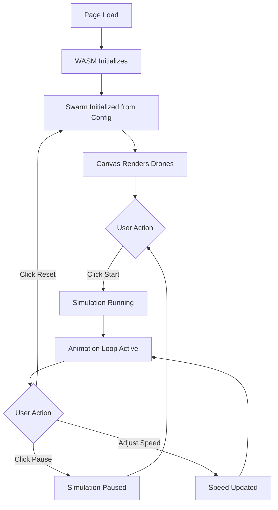
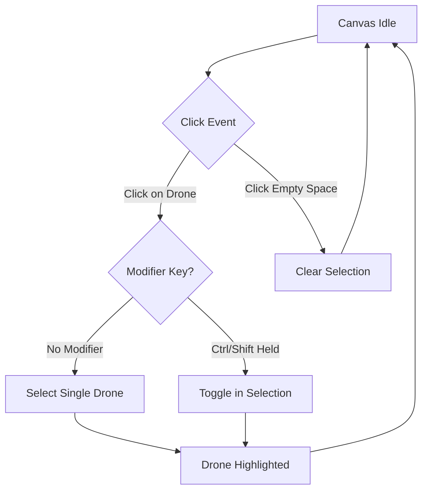
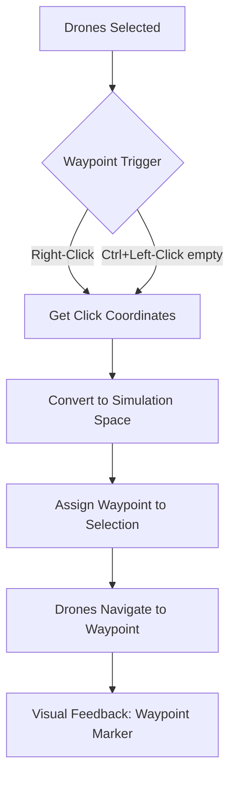

# DroneSwarm UI Specification
## Front-End Design Document

**Version:** 1.0
**Date:** 2026-01-06
**Framework:** SvelteKit with TypeScript
**Business Spec Reference:** [BUSINESS-LOGIC-SPEC.md](./BUSINESS-LOGIC-SPEC.md)

---

## 1. Overview

### Purpose
A single-page web application for visualizing and controlling a 2D quadcopter drone swarm simulation. The UI renders drones on a canvas, provides simulation controls, and allows users to interact with drones through selection and waypoint assignment.

### Theming Approach
- **Color scheme**: Dark theme optimized for simulation visualization
  - Background: Dark gray (#1a1a2e) for canvas contrast
  - UI elements: Slate grays with subtle blue accents
  - High contrast drone colors against dark background
- **Visual direction**: Technical/scientific aesthetic with clean lines and minimal ornamentation
- **No light/dark toggle** for v1.0 - dark theme only

---

## 2. Information Architecture

### Application Structure

```
┌─────────────────────────────────────────┐
│              DroneSwarm App             │
│                                         │
│  ┌───────────────────────────────────┐  │
│  │         Single Page View          │  │
│  │  ┌─────────────────────────────┐  │  │
│  │  │      Control Panel          │  │  │
│  │  └─────────────────────────────┘  │  │
│  │  ┌─────────────────────────────┐  │  │
│  │  │                             │  │  │
│  │  │      Simulation Canvas      │  │  │
│  │  │                             │  │  │
│  │  └─────────────────────────────┘  │  │
│  │  ┌─────────────────────────────┐  │  │
│  │  │      Status Bar             │  │  │
│  │  └─────────────────────────────┘  │  │
│  └───────────────────────────────────┘  │
└─────────────────────────────────────────┘
```

### Navigation Structure
- **No navigation required** - Single page application
- **No routing** - All interaction happens on one view
- Deep linking not applicable for v1.0

---

## 3. User Flows

### 3.1 Primary Flow: Run Simulation



### 3.2 Drone Selection Flow



### 3.3 Waypoint Assignment Flow



### 3.4 Path Drawing Mode Flow

```mermaid
flowchart TD
    A[Normal Mode] --> B{Press P Key}
    B --> C[Enter Path Mode]
    C --> D[Status shows "Path Mode"]
    D --> E{Click on Canvas}
    E -->|Left-Click| F[Add Waypoint to Path]
    F --> G[Waypoint Marker Added]
    G --> E
    E -->|Right-Click or Enter| H[Confirm Path]
    H --> I[Assign Path to Selected Drones]
    I --> J[Exit Path Mode]
    E -->|Escape| K[Cancel Path]
    K --> J
    J --> A
```

**Path Mode Behavior:**
- Visual indicator: Status bar shows "PATH MODE" in amber
- Each click adds a numbered waypoint marker (1, 2, 3...)
- Preview line connects waypoints in sequence
- Right-click or Enter confirms and assigns path
- Escape cancels without assigning
- Minimum 1 waypoint required to confirm

---

## 4. Page Specification

### 4.1 Main Simulation View

**Purpose**: The sole view of the application - displays the drone swarm simulation with controls.

**Wireframe**:
```
+------------------------------------------------------------------+
|  [CONTROL PANEL]                                                  |
|  +----------+  +----------+  +----------+  +------------------+   |
|  |  ▶ Start |  |  ⏸ Pause |  |  ↺ Reset |  | Speed: [====●==] |   |
|  +----------+  +----------+  +----------+  | 0.25x      4x    |   |
|                                            +------------------+   |
+------------------------------------------------------------------+
|                                                                   |
|                     SIMULATION CANVAS                             |
|                                                                   |
|        ●→                                                         |
|                    ●→           ●→                                |
|                                                                   |
|              ●→                                                   |
|                          ●→                                       |
|                                                                   |
|   [Selected drone has highlight ring]                             |
|   [Waypoint marker shown as X]                                    |
|                                                                   |
+------------------------------------------------------------------+
|  [STATUS BAR]                                                     |
|  Time: 00:42.5 | Drones: 10 | Selected: 2 | Speed: 1.0x | ● Live |
+------------------------------------------------------------------+
```

**Components Used**:
- `ControlPanel` - Simulation controls
- `SimulationCanvas` - Main canvas rendering
- `StatusBar` - Real-time status display
- `SpeedSlider` - Speed multiplier control
- `Button` - Start/Pause/Reset actions

**States**:
| State | Description | Visual Treatment |
|:------|:------------|:-----------------|
| Loading | WASM module loading | "Initializing..." text centered on canvas area |
| Ready | Simulation initialized, paused | Canvas shows drones at spawn, Start button enabled |
| Running | Simulation active | Animation loop running, Pause button highlighted |
| Paused | Simulation stopped | Canvas frozen, Start button enabled |
| Error | WASM failed to load | Error message with retry button |

**Responsive Behavior**:
- **Desktop (>1024px)**: Full layout as shown, canvas fills available space
- **Tablet (768-1024px)**: Same layout, reduced padding, canvas scales proportionally
- **Mobile (<768px)**:
  - Control panel stacks vertically
  - Speed slider moves below buttons
  - Canvas maintains aspect ratio with letterboxing
  - Touch events for selection (tap = click, long-press = right-click)

---

## 5. Component Inventory

| Component | Props | Variants | Notes |
|:----------|:------|:---------|:------|
| `Button` | `label`, `onClick`, `disabled`, `icon`, `variant` | primary, secondary, icon-only | Simulation control buttons |
| `SpeedSlider` | `value`, `onChange`, `min`, `max`, `step` | default | Range 0.25 - 4.0 |
| `SimulationCanvas` | `swarm`, `onDroneClick`, `onCanvasClick`, `onWaypointSet` | default | Main visualization |
| `StatusBar` | `time`, `droneCount`, `selectedCount`, `speed`, `isRunning`, `pathMode` | default | Bottom status display |
| `ControlPanel` | `isRunning`, `onStart`, `onPause`, `onReset`, `speed`, `onSpeedChange` | default | Top control bar |
| `DroneTooltip` | `drone`, `position`, `visible` | default | Hover info on drone |
| `PathModeIndicator` | `active`, `waypointCount` | default | Path mode status badge |

---

### 5.1 Button

**Purpose**: Trigger simulation actions (Start, Pause, Reset).

**Props**:
```typescript
interface ButtonProps {
  label: string;
  onClick: () => void;
  disabled?: boolean;
  icon?: 'play' | 'pause' | 'reset';
  variant?: 'primary' | 'secondary' | 'icon-only';
}
```

**Variants**:
| Variant | Description | When to Use |
|:--------|:------------|:------------|
| primary | Blue background, white text | Primary action (Start) |
| secondary | Gray background, light text | Secondary actions (Pause, Reset) |
| icon-only | Icon without label | Compact toolbar mode |

**States**: hover (lighten), active (darken), disabled (50% opacity, no pointer)

---

### 5.2 SpeedSlider

**Purpose**: Adjust simulation speed multiplier.

**Props**:
```typescript
interface SpeedSliderProps {
  value: number;           // Current speed (0.25 - 4.0)
  onChange: (speed: number) => void;
  disabled?: boolean;
}
```

**Behavior**:
- Snap points at: 0.25, 0.5, 1.0, 2.0, 4.0
- Display current value as label (e.g., "1.0x")
- Keyboard: Arrow keys adjust by 0.25 increments

**Visual**:
```
Speed: [====●=====] 1.0x
       0.25x     4x
```

---

### 5.3 SimulationCanvas

**Purpose**: Render drone swarm visualization and handle interactions.

**Props**:
```typescript
interface SimulationCanvasProps {
  renderState: DroneRenderData[];
  selectedIds: Set<number>;
  waypoints: Map<number, {x: number, y: number}>;  // Active waypoints per drone
  bounds: { width: number; height: number };
  onDroneClick: (id: number, multiSelect: boolean) => void;
  onEmptyClick: () => void;
  onWaypointSet: (x: number, y: number) => void;
}
```

**Rendering Layers** (bottom to top):
1. Background grid (subtle, for spatial reference)
2. Waypoint markers (X symbols where drones are heading)
3. Drone bodies (colored circles)
4. Heading arrows (from center of drone)
5. Selection highlights (ring around selected drones)
6. Hover highlight (if hovering over drone)

**Drone Rendering**:
```
     ┌─────┐
     │  ●→ │   Normal drone: filled circle + arrow
     └─────┘

     ┌─────┐
     │ (●→)│   Selected drone: ring around circle
     └─────┘

     ┌─────┐
     │ [●→]│   Hovered drone: subtle glow
     └─────┘
```

**Interaction Zones**:
- Drone hitbox: 20px radius from center (for easier clicking)
- Canvas: full area for waypoint setting

---

### 5.4 StatusBar

**Purpose**: Display real-time simulation status.

**Props**:
```typescript
interface StatusBarProps {
  simulationTime: number;    // Seconds elapsed
  droneCount: number;
  selectedCount: number;
  speed: number;
  isRunning: boolean;
}
```

**Layout**:
```
Time: 00:42.5 | Drones: 10 | Selected: 2 | Speed: 1.0x | ● Live
                                                         ○ Paused
```

**Time Format**: `MM:SS.s` (minutes, seconds, tenths)

---

### 5.5 ControlPanel

**Purpose**: Container for all simulation controls.

**Props**:
```typescript
interface ControlPanelProps {
  isRunning: boolean;
  isPaused: boolean;
  onStart: () => void;
  onPause: () => void;
  onReset: () => void;
  speed: number;
  onSpeedChange: (speed: number) => void;
}
```

**Layout**:
```
+------------------------------------------------------------------+
|  [▶ Start]  [⏸ Pause]  [↺ Reset]  |  Speed: [====●====] 1.0x    |
+------------------------------------------------------------------+
```

**Button States**:
| Simulation State | Start | Pause | Reset |
|:-----------------|:------|:------|:------|
| Ready (initial) | Enabled | Disabled | Disabled |
| Running | Disabled | Enabled | Enabled |
| Paused | Enabled | Disabled | Enabled |

---

### 5.6 DroneTooltip

**Purpose**: Display drone status information on hover.

**Props**:
```typescript
interface DroneTooltipProps {
  drone: {
    id: number;
    position: { x: number; y: number };
    velocity: { x: number; y: number };
    objectiveType: 'Sleep' | 'Loiter' | 'ReachWaypoint' | 'FollowTarget';
    waypointTarget?: { x: number; y: number };
  };
  screenPosition: { x: number; y: number };
  visible: boolean;
}
```

**Content Layout**:
```
+---------------------------+
| Drone #3                  |
| Status: Moving            |
| Position: (234, 567)      |
| Speed: 28.5 m/s           |
| Target: (500, 200)        |
+---------------------------+
```

**Behavior**:
- Appears after 300ms hover delay on drone
- Positioned above drone, offset to avoid cursor
- Auto-repositions to stay within viewport
- Disappears immediately on mouse leave
- Does not appear during path mode

**Status Display**:
| Objective Type | Status Text |
|:---------------|:------------|
| Sleep | "Idle" |
| Loiter | "Hovering" |
| ReachWaypoint | "Moving to (x, y)" |
| FollowTarget | "Following Drone #N" |

---

### 5.7 PathModeIndicator

**Purpose**: Visual indicator when path drawing mode is active.

**Props**:
```typescript
interface PathModeIndicatorProps {
  active: boolean;
  waypointCount: number;
  onCancel: () => void;
}
```

**Layout** (shown in status bar area when active):
```
+------------------------------------------+
| 🛤️ PATH MODE | Waypoints: 3 | [Cancel]   |
+------------------------------------------+
```

**Styling**:
- Background: Amber (#F59E0B) with 20% opacity
- Text: Amber (#F59E0B)
- Pulsing border animation to draw attention

---

## 6. Module Definitions

### 6.1 SimulationModule

**Purpose**: Manages WASM integration and simulation state.

**Components included**:
- `SimulationCanvas`
- `ControlPanel`
- `StatusBar`

**State ownership**:
```typescript
interface SimulationState {
  swarm: Swarm | null;           // From WASM
  isRunning: boolean;
  isPaused: boolean;
  renderState: DroneRenderData[];
  selectedDrones: Set<number>;
  speed: number;
  simulationTime: number;
  // Path mode state
  pathMode: boolean;
  currentPath: Array<{ x: number; y: number }>;
  // Tooltip state
  hoveredDroneId: number | null;
  tooltipPosition: { x: number; y: number } | null;
}
```

**Key state transitions**:
- `init` → `ready`: WASM loads, swarm initialized
- `ready` → `running`: User clicks Start
- `running` → `paused`: User clicks Pause
- `paused` → `running`: User clicks Start
- `* → ready`: User clicks Reset

**Data dependencies**:
- WASM module: `wasm_lib.js` exports
- Operations: `initializeSwarm`, `tick`, `getRenderState`, `selectDrone`, `assignWaypointToSelection`

---

### 6.2 CanvasModule

**Purpose**: Handles all canvas rendering logic.

**Components included**:
- `SimulationCanvas` (internal rendering)

**Rendering pipeline**:
1. Clear canvas
2. Draw grid (always enabled, subtle 15% opacity)
3. If pathMode: Draw path preview (connected waypoint markers with line)
4. For each drone in renderState:
   - Calculate screen position from simulation coordinates
   - Draw drone circle with color
   - Draw heading arrow
   - If selected: draw selection ring
   - If hovered: draw hover glow
5. Draw waypoint markers for active objectives
6. If hoveredDroneId: Render DroneTooltip component
7. Request next frame (if running)

**Coordinate transformation**:
```typescript
// Simulation space (0,0 to bounds) → Screen space (0,0 to canvas size)
function toScreen(simX: number, simY: number): { x: number, y: number } {
  return {
    x: (simX / bounds.width) * canvas.width,
    y: (simY / bounds.height) * canvas.height  // Y may need inversion
  };
}

function toSimulation(screenX: number, screenY: number): { x: number, y: number } {
  return {
    x: (screenX / canvas.width) * bounds.width,
    y: (screenY / canvas.height) * bounds.height
  };
}
```

---

## 7. Interaction Patterns

### 7.1 Canvas Interactions

| Action | Trigger | Result |
|:-------|:--------|:-------|
| Select single drone | Left-click on drone | Clear selection, select clicked drone |
| Add to selection | Ctrl+Left-click on drone | Toggle drone in selection |
| Add to selection | Shift+Left-click on drone | Toggle drone in selection |
| Clear selection | Left-click on empty canvas | Deselect all drones |
| Set waypoint | Right-click on canvas | Assign waypoint to all selected drones |
| Set waypoint (alt) | Ctrl+Left-click on empty canvas | Assign waypoint (alternative) |
| **Path Mode** | | |
| Enter path mode | Press `P` key | Enable path drawing mode |
| Add path waypoint | Left-click on canvas (in path mode) | Add waypoint to current path |
| Confirm path | Right-click or Enter (in path mode) | Assign path to selected drones, exit mode |
| Cancel path | Escape (in path mode) | Discard path, exit mode |

**Note:** Browser context menu is disabled on the canvas element to enable right-click waypoint assignment.

### 7.2 Keyboard Shortcuts

| Key | Action | Context |
|:----|:-------|:--------|
| `Space` | Toggle Start/Pause | Global |
| `R` | Reset simulation | Global |
| `Escape` | Clear selection / Cancel path mode | Global |
| `A` | Select all drones | Global |
| `+` / `=` | Increase speed | Global |
| `-` | Decrease speed | Global |
| `P` | Toggle path drawing mode | Global (requires selection) |
| `Enter` | Confirm path | Path mode only |

### 7.3 Touch Interactions (Mobile)

| Action | Trigger | Result |
|:-------|:--------|:-------|
| Select drone | Tap on drone | Select single drone |
| Multi-select | Two-finger tap on drone | Add/remove from selection |
| Set waypoint | Long-press on canvas | Assign waypoint |
| Clear selection | Tap on empty canvas | Deselect all |

### 7.4 Hover Effects

| Element | Hover Effect |
|:--------|:-------------|
| Drone | Subtle glow, cursor: pointer |
| Button | Background lighten |
| Slider | Track highlight |
| Canvas (empty) | Crosshair cursor when drones selected |

---

## 8. Loading and Transitions

### 8.1 Initial Load Sequence

```
1. Page renders shell (control panel disabled)
2. "Initializing simulation..." displayed on canvas area
3. WASM module loads asynchronously
4. initializeSwarm() called with default/loaded config
5. First render of drones
6. Controls enabled, status shows "Ready"
```

**Loading indicator**: Centered text with subtle pulse animation

### 8.2 Animation Loop

```typescript
function gameLoop(timestamp: number) {
  if (!isRunning) return;

  const dt = (timestamp - lastTimestamp) / 1000;  // Convert to seconds
  lastTimestamp = timestamp;

  // Update simulation via WASM
  swarm = tick(swarm, dt);

  // Get render data
  renderState = getRenderState(swarm);

  // Trigger Svelte reactivity / canvas redraw
  invalidate();

  requestAnimationFrame(gameLoop);
}
```

### 8.3 State Transitions

| Transition | Animation |
|:-----------|:----------|
| Start → Running | None (immediate) |
| Running → Paused | None (immediate) |
| Reset | Fade out (200ms) → Reset state → Fade in (200ms) |

---

## 9. Error States

### 9.1 Page-Level Errors

**WASM Load Failure**:
```
+------------------------------------------+
|                                          |
|     ⚠️ Failed to load simulation         |
|                                          |
|     The WebAssembly module could not     |
|     be initialized.                      |
|                                          |
|     [Retry]  [View Details]              |
|                                          |
+------------------------------------------+
```

**Browser Compatibility**:
```
+------------------------------------------+
|                                          |
|     ⚠️ Browser not supported             |
|                                          |
|     This application requires a modern   |
|     browser with WebAssembly support.    |
|                                          |
|     Supported: Chrome 57+, Firefox 52+,  |
|                Safari 11+, Edge 16+      |
|                                          |
+------------------------------------------+
```

### 9.2 Business Rule Error Messages

| Error Code | User Message | UI Location |
|:-----------|:-------------|:------------|
| `NO_SELECTION` | "Select one or more drones first" | Toast notification |
| `INVALID_MULTIPLIER` | "Speed must be between 0.25x and 4x" | Inline below slider |
| `WASM_ERROR` | "Simulation error occurred" | Modal with details |

### 9.3 Notification Toast

- **Position**: Top-right corner
- **Duration**: 3 seconds (auto-dismiss)
- **Types**: info (blue), warning (amber), error (red)
- **Stacking**: New toasts push older ones down

---

## 10. Canvas Rendering Details

### 10.1 Drone Visual Specification

```
Drone Anatomy:

       ← Arrow (heading indicator)
      ╱
     ●────→        Drone radius: 12px (visual)
     │             Hit radius: 20px (interaction)
     │             Arrow length: 16px
   Body            Arrow width: 3px
 (circle)
```

**Colors**:
- Drone body: HSL color based on drone index (hue = index/count × 360)
- Drone stroke: White, 2px
- Selection ring: Cyan (#00FFFF), 3px, 4px gap from body
- Hover glow: White, 10px blur
- Heading arrow: Same color as body, slightly darker

### 10.2 Waypoint Marker

```
     ╲   ╱
      ╲ ╱
       ╳         Waypoint: X marker
      ╱ ╲        Color: Orange (#FF8800)
     ╱   ╲       Size: 8px
```

- Shown at destination of drones with active ReachWaypoint objective
- Pulsing animation (subtle scale 1.0 → 1.1 → 1.0)

### 10.3 Grid Overlay

**Always enabled** with subtle styling for spatial reference.

- Light gray lines (#333344)
- Spacing: 100 simulation units
- Opacity: 15% (subtle, non-distracting)
- Line width: 1px
- Purpose: Spatial reference, especially useful for understanding toroidal wrap-around
- Helps users estimate distances and positions

### 10.4 Toroidal Wrap Visualization

When a drone approaches an edge:
- Ghost rendering: Faded drone appears on opposite edge
- Helps user understand wrap-around behavior

```
Original                With Ghost
+----------+           +----------+
|          |           | ◐        |   ◐ = ghost (30% opacity)
|        ● |     →     |        ● |
|          |           |          |
+----------+           +----------+
```

---

## 11. Accessibility

### 11.1 Target Compliance
WCAG 2.1 Level AA

### 11.2 Keyboard Navigation

**Tab Order**:
1. Start button
2. Pause button
3. Reset button
4. Speed slider
5. Canvas (focusable for keyboard shortcuts)

**Focus Indicators**:
- Buttons: 2px cyan outline
- Slider: Track highlight + thumb glow
- Canvas: Subtle border highlight

### 11.3 Screen Reader Considerations

**ARIA Labels**:
```html
<button aria-label="Start simulation">▶ Start</button>
<button aria-label="Pause simulation">⏸ Pause</button>
<button aria-label="Reset simulation">↺ Reset</button>
<input type="range" aria-label="Simulation speed" aria-valuetext="1x speed">
<canvas role="img" aria-label="Drone swarm visualization showing 10 drones">
```

**Live Regions**:
- Status bar: `aria-live="polite"` for updates
- Selection changes: Announce "N drones selected"
- Errors: `aria-live="assertive"`

### 11.4 Color Contrast

- All text meets 4.5:1 contrast ratio against background
- Interactive elements meet 3:1 against adjacent colors
- Drone colors tested for distinguishability (not relying on color alone - different positions)

---

## 12. Terminology Reference

### Standard Terms

| Concept | Standard Term | Avoid Using |
|:--------|:--------------|:------------|
| Simulation unit | **Drone** | UAV, quadcopter, unit |
| Target location | **Waypoint** | Destination, target, goal |
| Drone group | **Swarm** | Fleet, cluster, group |
| Speed control | **Speed multiplier** | Time scale, fast forward |
| Edge behavior | **Wrap-around** | Toroidal, teleport |

### State Labels

| State | Display Text |
|:------|:-------------|
| Simulation ready | "Ready" |
| Simulation running | "Live" |
| Simulation paused | "Paused" |
| Drone idle | "Idle" |
| Drone moving | "Moving" |
| Drone at waypoint | "Arrived" |

### Loading State Standards

| Context | Loading Indicator | Loading Text |
|:--------|:------------------|:-------------|
| Initial WASM load | Centered text pulse | "Initializing simulation..." |
| Reset operation | Brief fade | None |
| Config load | Skeleton canvas | "Loading configuration..." |

---

## 13. Svelte Component Structure

### File Organization

```
webapp/src/
├── routes/
│   └── +page.svelte           # Main page (simulation view)
├── lib/
│   ├── components/
│   │   ├── ControlPanel.svelte
│   │   ├── SimulationCanvas.svelte
│   │   ├── StatusBar.svelte
│   │   ├── SpeedSlider.svelte
│   │   ├── Button.svelte
│   │   ├── Toast.svelte
│   │   ├── DroneTooltip.svelte    # Hover tooltip for drone info
│   │   └── PathModeIndicator.svelte # Path mode status badge
│   ├── stores/
│   │   └── simulation.ts      # Svelte stores for state
│   ├── wasm/
│   │   └── bridge.ts          # WASM integration layer
│   └── utils/
│       ├── canvas.ts          # Canvas rendering utilities
│       ├── coordinates.ts     # Coordinate transformations
│       └── pathDrawing.ts     # Path mode utilities
└── app.css                    # Global styles
```

### Store Structure

```typescript
// lib/stores/simulation.ts
import { writable, derived } from 'svelte/store';

export const swarm = writable<Swarm | null>(null);
export const isRunning = writable(false);
export const isPaused = writable(true);
export const selectedDrones = writable<Set<number>>(new Set());
export const speed = writable(1.0);

// Path mode state
export const pathMode = writable(false);
export const currentPath = writable<Array<{ x: number; y: number }>>([]);

// Tooltip state
export const hoveredDroneId = writable<number | null>(null);

export const renderState = derived(swarm, ($swarm) =>
  $swarm ? getRenderState($swarm) : []
);

export const selectedCount = derived(selectedDrones, ($sel) => $sel.size);
export const pathWaypointCount = derived(currentPath, ($path) => $path.length);
```

---

## 14. Implementation Checklist

### Components
- [ ] `Button` component with variants
- [ ] `SpeedSlider` component with snap points
- [ ] `ControlPanel` container component
- [ ] `StatusBar` component with live updates
- [ ] `SimulationCanvas` component with rendering
- [ ] `Toast` notification component
- [ ] `DroneTooltip` component with hover state
- [ ] `PathModeIndicator` component with status display

### Canvas Rendering
- [ ] Background grid rendering (always on, 15% opacity)
- [ ] Drone circle rendering with colors
- [ ] Heading arrow rendering
- [ ] Selection ring rendering
- [ ] Hover glow effect
- [ ] Waypoint marker rendering
- [ ] Ghost drone rendering (toroidal edges)
- [ ] Coordinate transformation (sim ↔ screen)
- [ ] Path preview rendering (connected waypoints with line)

### Interactions
- [ ] Left-click drone selection
- [ ] Ctrl/Shift multi-select
- [ ] Empty canvas click to deselect
- [ ] Right-click waypoint assignment
- [ ] Ctrl+Left-click waypoint assignment (alternative)
- [ ] Keyboard shortcuts (Space, R, Escape, A, +/-, P, Enter)
- [ ] Touch support for mobile
- [ ] Drone hover detection with tooltip
- [ ] Path mode toggle (P key)
- [ ] Path waypoint addition (click in path mode)
- [ ] Path confirmation (Right-click/Enter in path mode)
- [ ] Path cancellation (Escape in path mode)

### State Management
- [ ] Svelte stores for simulation state
- [ ] WASM bridge functions
- [ ] Animation loop with requestAnimationFrame
- [ ] Speed multiplier integration

### Accessibility
- [ ] ARIA labels on all controls
- [ ] Keyboard navigation support
- [ ] Focus indicators
- [ ] Screen reader live regions

### Error Handling
- [ ] WASM load failure UI
- [ ] Browser compatibility check
- [ ] Toast notifications for user errors
